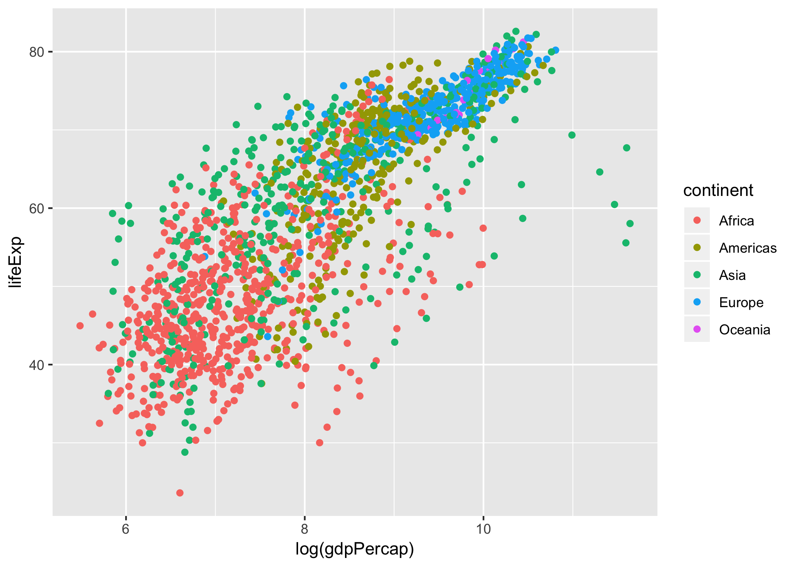

Load packages
```{r}
suppressPackageStartupMessages(require(tidyverse))
suppressPackageStartupMessages(require(gapminder))
```
View first few rows of dataset 
```{r}
head(gapminder)
```
Inspect what are the continents
```{r}
unique(gapminder$continent)
```

# Part 1: Factor Management
Concrete information of the data before removing Oceania
```{r}
str(gapminder)
```
Concrete information of the data after removing Oceania
```{r}
gapminder %>%
  filter(continent != "Oceania") %>% 
  droplevels() %>% 
  str()
```
We can tell from above that 
* Number of rows decreased from 1704 to 1680. 
* Number of countries decreased from 142 to 140.
* Number of continents decreased from 5 to 4.

```{r}
suppressPackageStartupMessages(require(forcats))
```

Now arrange factors in order. Compared with the the [scatter plot](#visualization-design) later, this has no effect on the plot.
```{r}
gapminder %>% 
  arrange(gdpPercap) %>% 
  ggplot(aes(log(gdpPercap),lifeExp,color=continent)) + geom_point()
```

There are two countries in Oceania, and they are Australia and Newzealand. It is also obvious that Oceania is removed.
```{r}
gapminder %>% 
  filter(continent == "Oceania")
```

# Part 2: File I/O
Save mean lifeExp into `mean_life_exp.csv`
```{r}
(mean_life_exp = gapminder %>% 
  group_by(country) %>% 
  summarise(mu = mean(lifeExp)))
write_csv(mean_life_exp, "mean_life_exp.csv")
```

# Part 3: Visualization Design
Load package plotly
```{r}
suppressPackageStartupMessages(require(plotly))
```

A scatter-plot of lifeExp vs log(gdpPercap) colored with continent
```{r}
(p = ggplot(gapminder, aes(log(gdpPercap), lifeExp, color=continent)) + geom_point())
```

Here is the same plot in plotly. This allows each data to be inspected in details in its values and corresponding continent. This is especially helpful in this case since data are clumped together.
```{r}
plot_ly(gapminder, x=~log(gdpPercap), y=~lifeExp, color=~continent)
```

# Part 4: Writing Figures to File
Save the above scatter-plot to file
```{r}
ggsave("scatter_plot.png", plot=p)
```
Specifying `plot=p` matters when you made mulitple plots and you just want to save one of them
```{r}
p0 = ggplot(gapminder, aes(lifeExp)) + geom_histogram()
ggsave("scatter_plot0.png", plot=p)
ggsave("hist0.png", plot=p0)
```
Here we embed the scatter plot into this document


